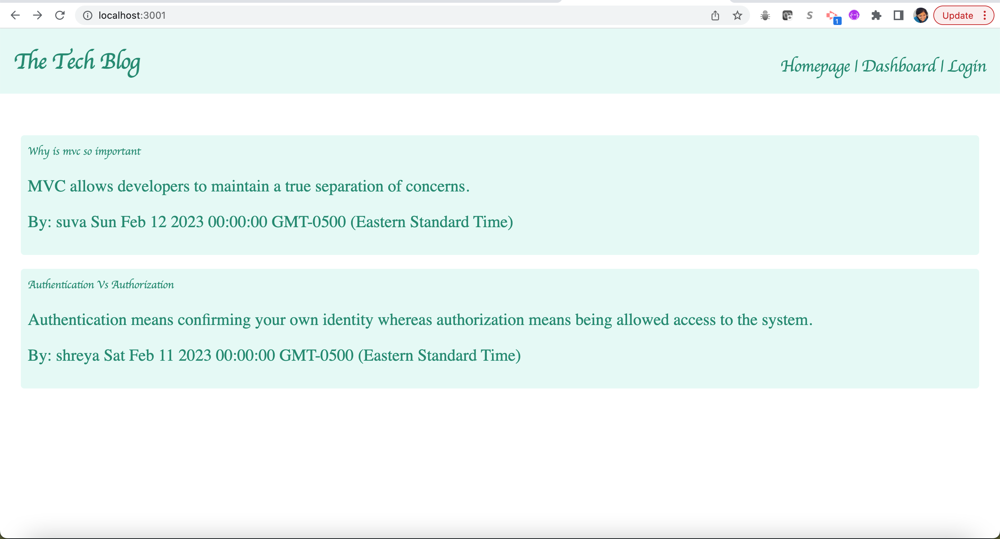

# tech-blog

## Description 

This is blog site where developers can publish their blog posts and comment on other developers’ posts. This application follows MVC paradigm in its architectural structure, using Handlebars.js as the templating language, Sequelize as the ORM, and the express-session npm package for authentication.

The application can be invoked by using 'node server.js' command. 

* When you visit the site for the first time then you are presented with the homepage, which includes existing blog posts if any have been posted; navigation links for the homepage and the dashboard; and the option to log in
* You can view your dashboard with your posts only when you are logged in. 
* When you click on Login, you can see an option to either Login or Signup
* Once logged in, you can see an option to logout.
* Once logged in you can see "+ New Post", which lets you create new post. 
* When you click on Dashboard, you can see the posts which belong to you.
* When you click on a post in your dashboard, you will see that the post shows up all the comments if any and an option to Update or Delete the post. Post contains title, content, date created, creator's name. 
* When you click on Update, you can update the existing post. When you click on Delete, you can delete the existing post.
* When you click on "New Comment", you can add a new comment for the post.
* You can also see "Edit Comment" and "Delete" comment.
* When you click on edit comment then youc an edit the existing comment, when you click on delete comment then you can delete the existing comment. 

## Features

* The features are same as explained in the description, please refer above.

## Installation

N/A

## Screenshot

## Link to the GitHub repo of the application

https://github.com/suvarna28/tech-blog

## Link to the deployed application on Heroku

https://obscure-oasis-36902.herokuapp.com/

## Credits

* Our TA, Sebastian Fave for helping in resolving homework related doubts. 
